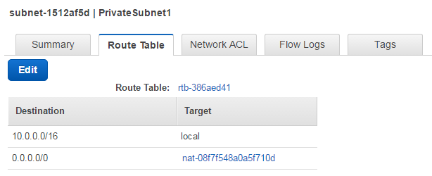
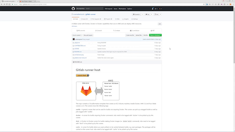
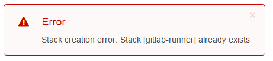
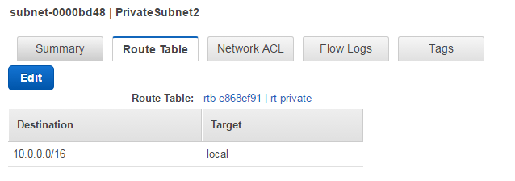

# Gitlab runner host


This repo contains a Cloudformation template that creates an EC2 Ubuntu machine, installs Docker, AWS CLI and four Gitlab runners on it. The runners have the following tags:

**vanilla** - A generic runner that can be used for builds not requiring Docker. This runner can pick up untagged builds as well as jobs tagged with "vanilla".

**docker** - A runner for builds requiring Docker commands. Jobs need to be tagged with "docker" to be picked up by this runner.

**dind** - A Docker-in-Docker runner for builds making Docker images (i.e. `docker build` command). Jobs need to be tagged with "dind" to be picked up by this runner.

**cache** - A runner for builds where you want artifacts to be cached between builds, e.g. npm packages. The packages will be cached on the runner host.  Jobs need to be tagged with "cache" to be picked up by this runner.

> <a href="https://docs.gitlab.com/ee/ci/runners" target="_blank">Read more about Gitlab runners here.</a>

An AWS role, policy and instance-profile that allows the Gitlab runner to assume other roles will be created. This is useful for builds that create AWS resources, e.g. deploying Cloudformation templates, which require AWS permissions to work. 
> <a href="https://docs.aws.amazon.com/STS/latest/APIReference/API_AssumeRole.html" target="_blank">Read more about assuming roles in AWS here.</a>

The runner host will be deployed to a security group allowing Internet access and option to do remote login to the host using SSH. 
> <a href="https://docs.aws.amazon.com/AWSEC2/latest/UserGuide/authorizing-access-to-an-instance.html" target="_blank">Read more about remote login here.</a>

## Installing the runner

### Before you start

To deploy the Gitlab runner template you need to have the following ready:

- An AWS account
- An  account on the Gitlab server you want to connect the runner to. Could be [gitlab.com](https://gitlab.com/) or your organization's enterprise Gitlab server.
- A Gitlab project on the Gitlab server. Could be an empty project, it's needed to connect the runner for the first time. 


You should also collect the following information to provide as parameters during the installation of the runner:

- __The AWS VPC id__ where you want to deploy the runner. (<a href="https://console.aws.amazon.com/vpc" target="_blank">Check your VPCs and subnets</a>, may require being logged in to AWS)
- __The Subnet Id__ of a subnet in the VPC. The subnet __must__ have Internet access. __*Tip:*__ Check that the Route Table tab on the Subnet you will use have a Destination to `0.0.0.0/0` with a specified Target in the <a href="https://console.aws.amazon.com/vpc?#subnets:" target="_blank">AWS VPC Console</a> (may require being logged in to AWS). An example of a subnet using a NAT gateway for providing Internet access is shown in the picture below:



- If you want to be able to log in remotely using SSH for e.g. debugging you need:
  - __An AWS key pair name__ (<a href="https://console.aws.amazon.com/ec2/v2/home#KeyPairs:sort=keyName" target="_blank">AWS Keys</a>, may require being logged in to AWS)

  - __The CIDR block__ you want to be able to remotely SSH login from. E.g. if you want to login with SSH from your current IP adress and it is `123.234.111.222` then enter `123.234.111.222/32` as CIDR.
    Your current IP adress can be found <a href="http://checkip.amazonaws.com/" target="_blank">here.</a>

    > **If you don't need SSH login you can ignore both AWS key pair name and CIDR.**
    
> If *"VPC", "Subnet", "NAT gateway", "AWS Keys" and "CIDR"* sounds like gobbledygook to you, talk to your AWS account or network administrator before you install the runner.
>
>[Learn about AWS VPC](https://docs.aws.amazon.com/AmazonVPC/latest/UserGuide/VPC_Introduction.html)

- __The Gitlab server URL__ the runner should connect to. Defaults to `https://gitlab.com` but if you are connecting to a company Gitlab the URL is something else.. 
> If you are connecting to your organization's Gitlab Enterprise server using that Gitlab's URL, make sure your runner host will be allowed to connect to that server and not get blocked by e.g. firewall settings. In doubt, verify with your Gitlab enterprise system administrator before you install the runner.
- __The Gitlab project registration token__ to connect the runner to the project.
  From your Gitlab project navigate to *Settings -> CI/CD -> Runner settings -> Registration token* under Specific runners.
  > <a href="https://docs.gitlab.com/ee/ci/runners/#registering-a-specific-runner-with-a-project-registration-token" target="_blank">Read more about registering runners here.</a> 


### Setup and install
For viewing a video demonstrating the setup, click on the picture below. __Note! If you are setting up a Gitlab runner for your organization's enterprise Gitlab be sure to use that Gitlab's URL instead of Gitlab.com when following the steps in this video__

[](https://dreambroker.com/channel/idl7qm47/53534bms)

#### Setup using the AWS console

Click   <a href="https://console.aws.amazon.com/cloudformation/home#/stacks/new?stackName=gitlab-runner&amp;templateURL=https://s3-eu-west-1.amazonaws.com/scaniadevtools-aws-templates/gitlabrunner-host.yml" target="_blank"></a> and follow the instructions. __NOTE!__ Remember to use your organizations' Gitlab URL instead of gitlab.com during the setup if you are connecting to a company Gitlab.


You can also upload the file `gitlabrunner-host.yml` in the AWS Cloudformation console of the AWS account where you want to deploy the runner. (<a href="https://eu-west-1.console.aws.amazon.com/cloudformation/home#/stacks/new" target="_blank">Click to open AWS Cloudformation console</a>, may require being logged in to AWS).

Then follow the Cloudformation console instructions.

#### Setup using AWS CLI
```sh
aws cloudformation create-stack --stack-name [STACK_NAME] --capabilities CAPABILITY_NAMED_IAM --parameters ParameterKey=GitLabRegistrationToken,ParameterValue=[GITLAB_TOKEN] ParameterKey=PrivateSubnetId,ParameterValue=[SUBNET_ID] ParameterKey=RunnerName,ParameterValue=[RUNNER_NAME] ParameterKey=SshCidr,ParameterValue=[SSHCIDR] ParameterKey=SshKeyName,ParameterValue=[SSH_KEYNAME] ParameterKey=VpcId,ParameterValue=[VPC_ID] --template-body file://gitlabrunner-host.yml --region [REGION]] [--profile PROFILE_NAME]
```

Example:

```sh
aws cloudformation create-stack --stack-name gitlab-runner-cli --capabilities CAPABILITY_NAMED_IAM --parameters ParameterKey=GitLabRegistrationToken,ParameterValue=abcdefg1234567 ParameterKey=PrivateSubnetId,ParameterValue=subnet-abcd1234 ParameterKey=RunnerName,ParameterValue=gitlab-runner-cli ParameterKey=SshCidr,ParameterValue=127.0.0.1/32 ParameterKey=SshKeyName,ParameterValue=mykeyname ParameterKey=VpcId,ParameterValue=vpc-efgh5678 --template-body file://gitlabrunner-host.yml --region eu-west-1 --profile default
```

## Next steps
Now when you have a runner we encourage you to try it out. We have prepared some ready-to-go samples we suggest you start with to get the basic of using the runner. The following examples demonstrates deploying AWS resources, AWS permissions setup, using multiple AWS accounts for deployment etc:

* __[gitlab-aws-helloworld](https://github.com/scaniadevtools/gitlab-aws-helloworld)__ - Deploys a single AWS resource to your AWS account, a good getting-started sample

 <br>
 <br>
  
__Happy Hacking__

*Scania Devtools Team*

## Want to contribute?
Go to the <a href="CONTRIBUTING.md">CONTRIBUTING</a> page.


# Troubleshooting
## I get Stack [gitlab-runner] already exists error


This means that there is already a cloudformation stack deployed in your account with the same name you are trying to use. Either delete the existing stack or provide another (unique) name in the "Stack name" field for your stack. Note that changing the stack name effects the name of the role that is created by the stack (this name is used in later steps).

## I can't find my new runner in Gitlab

* Make sure you are in the right Gitlab, e.g. gitlab.com or your enterprise Gitlab.

* Make sure your runner was registered to the correct Gitlab, , e.g. gitlab.com or your enterprise Gitlab.

* Check the registration token used for assigning the runner to a project.

* When connecting to an enterprise Gitlab, verify that the Gitlab master allows connections from your AWS VPC your runner is setup in. Talk to your Gitlab enterprise system administrator.

* The Subnet you are using might not have internet access to download the software it needs for the setup. Go to the [VPC console](https://console.aws.amazon.com/vpc?#subnets) and check the Route Table for the Subnet. If it looks as the picture below (i.e. has no route to Internet) try installing in another Subnet. If that does not work, talk to your AWS account or network administrator or a friend having a AWS Networking black belt or similar.


